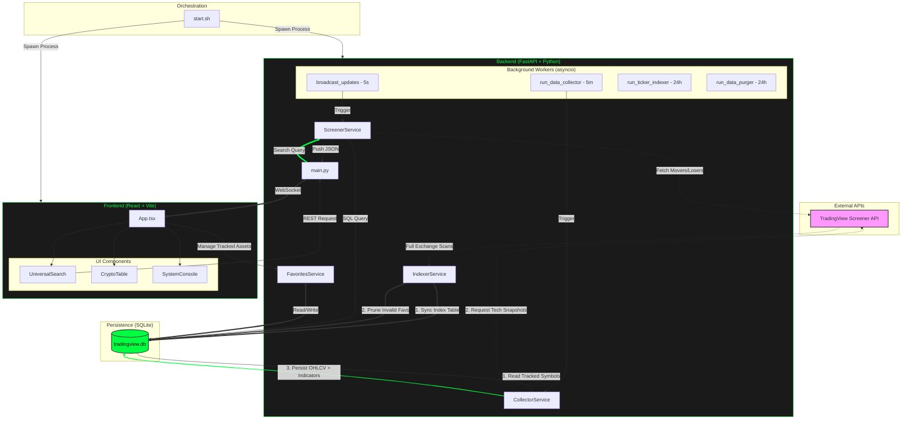

# Market Trading Screener



A high-precision, retro-terminal style cryptocurrency screener for the "Big Four" exchanges: **Binance, Bybit, Bitget, and OKX**.

## Features
- **Real-time Monitoring**: Top Movers and Top Losers tabs with 5-second unified refresh.
- **Full Market Indexing**: Access to over 5,800+ trading pairs (Spot and USDT Perpetuals).
- **Technical Indicators**: Integrated SMA (20/50/200), MACD, and RSI values.
- **Interactive Help**: Floating terminal-style documentation for technical indicators.
- **Persistence**: Favorite assets are tracked and saved locally for long-term analysis.

---

## Technical Highlights
- **Server-Side Sorting**: True "Top Movers" and "Top Losers" are calculated across the entire 5,800+ ticker catalog via API sort commands.
- **Hybrid Communication**: Uses WebSockets for live gainer pushes and REST for high-precision history and loser polling.
- **Data Retention**: Local SQLite database with a 6-month rolling purge policy for favorite indicators.
- **Liquidity Guard**: Integrated 50,000 USD (24h) volume floor to filter out illiquid assets.

---

## Setup & Installation

### 1. Prerequisites
- Python 3.10+
- Node.js & npm

### 2. Quick Start
The easiest way to start both the backend and frontend is using the provided start script:

```bash
chmod +x start.sh
./start.sh
```

### 3. Database Initialization
Since the database is local and not stored in the repository, it will be automatically created the first time you run the application.

To populate the search index with all ~5,800 tickers from the exchanges, the system runs a background sync automatically on startup. You can monitor the progress in `backend.log`.

---

## Detailed Architecture
For a deep dive into the service logic, database schema, and development lifecycle, see [ARCHITECTURE.md](docs/ARCHITECTURE.md).

## License
MIT