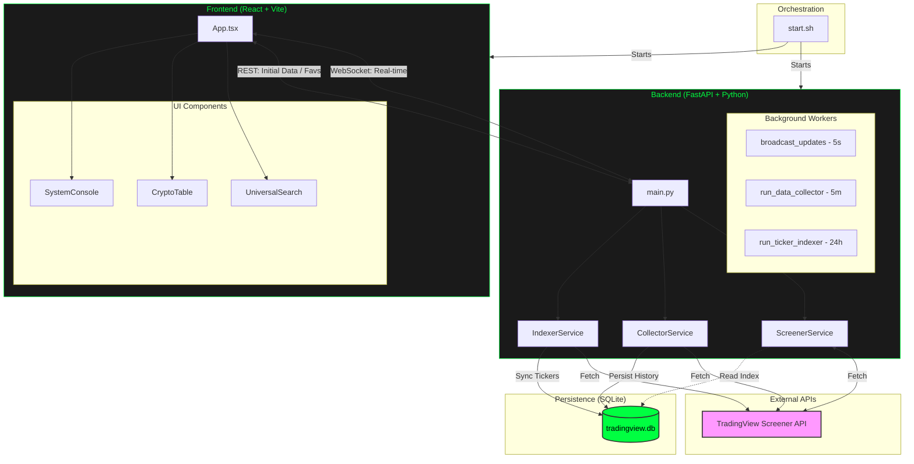

# Project Architecture

This document provides a high-level overview of the Market Trading Screener architecture, logic flow, and technology stack.

## System Architecture Diagram

## Data Flow Logic

### 1. Real-time Market Data
- **Mechanism**: The backend runs a `broadcast_updates` worker every 5 seconds.
- **Path**: `TradingView API` -> `ScreenerService` -> `FastAPI WebSocket` -> `React App State` -> `CryptoTable UI`.
- **Optimization**: Data is pushed via WebSockets to connected clients only when active, minimizing unnecessary API calls.

### 2. Historical Data Collection
- **Mechanism**: The `CollectorService` runs every 5 minutes.
- **Path**: `TradingView API` -> `CollectorService` -> `SQLModel` -> `tradingview.db`.
- **Retention**: Data is persisted for up to 6 months for "Favorite" assets across 11 timeframes.

### 3. Ticker Indexing
- **Mechanism**: The `IndexerService` runs once every 24 hours.
- **Path**: `TradingView API` -> `IndexerService` -> `SQLite (ticker_index)`.
- **Purpose**: Enables the `UniversalSearch` to instantly find all ~5,800+ tickers from the "Big Four" exchanges (Binance, Bybit, Bitget, OKX).

---

## Technical Development Process (High-Level)

As a newcomer to software engineering, it is helpful to visualize how a single code change moves through the system. For example, if we were to add a **"Market Sentiment"** indicator:

1.  **Database Layer (`models.py`)**: Define the new data field in the `MarketDataHistory` model.
2.  **Service Layer (`screener.py`)**: Map the new TradingView API field to our internal logic.
3.  **API Layer (`main.py`)**: Update the endpoint responses to include the new field.
4.  **Frontend State (`App.tsx`)**: Update the React state interfaces to handle the new data.
5.  **UI Layer (`CryptoTable.tsx`)**: Add a new column to the table to display the sentiment to the user.

## Technology Stack Justification

| Technology | Role | Why we use it |
| :--- | :--- | :--- |
| **FastAPI** | Backend Framework | Extremely fast, supports asynchronous tasks (WebSockets) out of the box. |
| **SQLModel** | Database ORM | Combines SQLAlchemy and Pydantic for type-safe database interactions. |
| **React** | Frontend Framework | Component-based structure makes it easy to build complex, interactive dashboards. |
| **Vite** | Frontend Tooling | Provides an instant development environment and lightning-fast build times. |
| **Tailwind CSS** | Styling | Allows for rapid UI development using utility classes directly in the components. |
