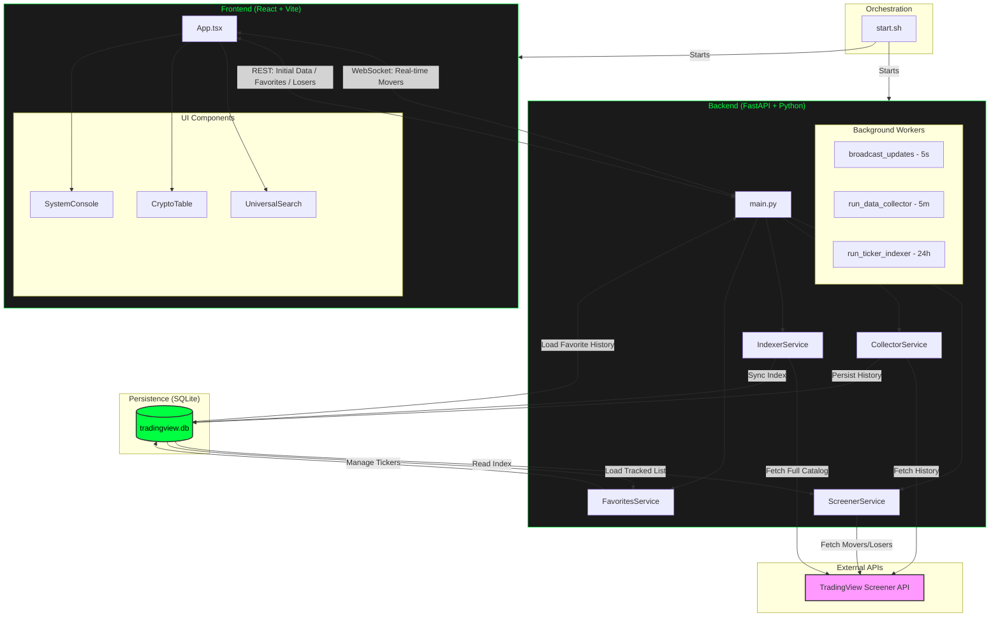

# Project Architecture & Technical Deep-Dive

This document provides a comprehensive technical overview of the Market Trading Screener. It details the system's architecture, data synchronization logic, and the full-stack development process.

## System Architecture Diagram

---

## Core Logic & Synchronization

### 1. Hybrid Data Fetching (WebSocket vs. Polling)
The application uses a dual-channel communication strategy to ensure the UI is always responsive:
- **WebSocket (Push)**: The backend runs a `broadcast_updates` worker every 5 seconds. It pushes the latest **Top Movers** data to all connected clients. This is the primary channel for real-time price action.
- **REST API (Pull/Polling)**:
    - **Initial Load**: When the app starts, it performs a REST fetch for the first snapshot.
    - **Top Losers**: Since the WebSocket broadcast is optimized for gainers, the **Top Losers** tab uses a 5-second interval poller to fetch data from the `/api/v1/screener/top-movers?sort=asc` endpoint.
    - **Favorites**: The **Tracked Assets** table fetches data via REST to allow for complex interval-switching (e.g., viewing 1H data while the main movers are on 5M).

### 2. Market-Wide Sorting (Server-Side)
Unlike basic screeners that sort a pre-loaded list, this system performs **Server-Side Sorting**:
- When you request "Top Losers," the backend sends a sort command to TradingView's servers: `cs.sort_by("change|X", ascending=True)`.
- This ensures the results are drawn from the **entire ~5,800+ ticker catalog**, not just the coins currently visible on your screen.

### 3. Liquidity & Quality Filtering
To prevent "Flash Crashes" on dead coins or price glitches from appearing as valid signals, a strict **Liquidity Floor** is enforced:
- **Constraint**: `VOLUME_24H_IN_USD > 50,000`.
- **Effect**: Any ticker with less than 50k USD in daily trading volume is excluded from the Movers and Losers lists.

---

## Database Architecture (`tradingview.db`)

The project uses **SQLite** with **SQLModel** for local persistence.

| Table | Purpose | Retention |
| :--- | :--- | :--- |
| **`ticker_index`** | A searchable list of all 5,800+ tickers from the Big Four. | Synced every 24 hours. |
| **`favorites`** | Stores the symbols you have chosen to track. | Permanent until removed. |
| **`market_data_history`** | Stores OHLCV and Indicators for your favorites across 11 intervals. | **6 months + 1 day** (rolling purge). |

---

## Full-Stack Development Lifecycle

To illustrate the development process, consider the implementation of the **Top Losers Tab**:

1.  **Requirement**: Add a way to see the worst performers in the market.
2.  **Backend Service (`screener.py`)**: Modified `get_top_movers` to accept a `sort_descending` parameter.
3.  **API Layer (`main.py`)**: Added a `sort` query parameter to the `/top-movers` endpoint.
4.  **Frontend State (`App.tsx`)**: Created `activeSort` state to toggle between `desc` (Gainers) and `asc` (Losers).
5.  **Synchronization**: Implemented a `useEffect` hook to ensure that switching the tab triggers an immediate data refresh and adjusts the polling frequency.
6.  **UI Component (`CryptoTable.tsx`)**: Added a `defaultSortDir` prop so the table knows whether to show the largest or smallest numbers at the top when the data arrives.

---

## Technology Stack Justification (Technical Detail)

- **FastAPI (Asynchronous Python)**: Chosen for its native support for `asyncio`, which is critical for handling WebSockets and background tasks (like the Indexer and Collector) without blocking the main API.
- **SQLModel (SQLAlchemy + Pydantic)**: Provides a single source of truth for our data models. We define a class once, and it serves as both the Database Table and the JSON API Schema.
- **React 19 (TypeScript)**: Uses strict typing to catch errors during development. The `useMemo` hook is used extensively in `CryptoTable.tsx` to handle sorting and filtering of 1,000+ rows efficiently without UI lag.
- **Tailwind CSS (Utility-First)**: Enabled the rapid creation of the "Retro-Terminal" aesthetic using custom color configurations and "Breathing Light" animations.
