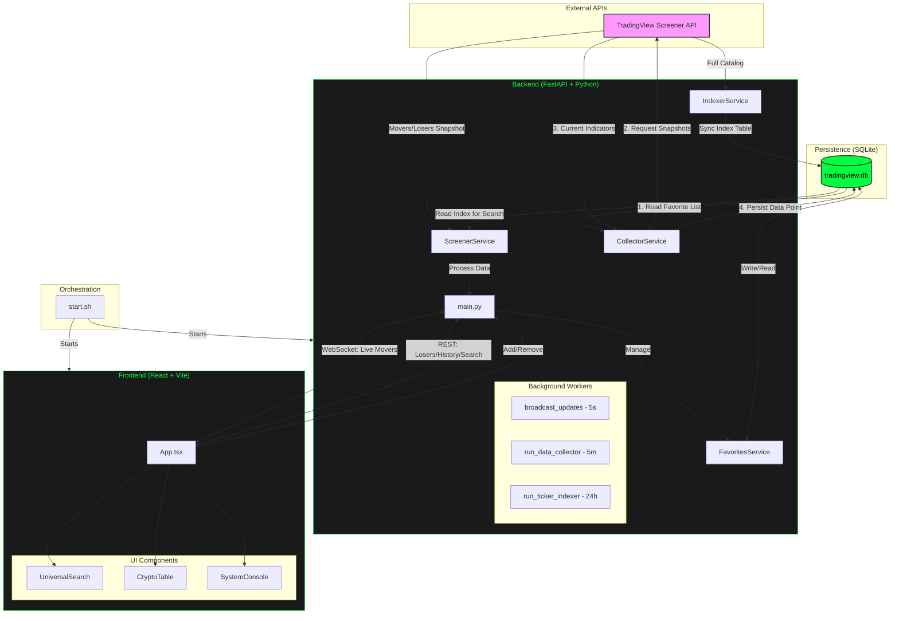

# Project Architecture & Technical Deep-Dive

This document provides a high-level overview of the Market Trading Screener architecture, logic flow, and technology stack.

## System Architecture Diagram

---

## Core Logic & Synchronization

### 1. Hybrid Data Fetching (WebSocket vs. Polling)
The application uses a dual-channel communication strategy to ensure the UI is always responsive:
- **WebSocket (Push)**: The backend runs a `broadcast_updates` worker every 5 seconds. It pushes the latest **Top Movers** data to all connected clients.
- **REST API (Pull/Polling)**:
    - **Top Losers**: The UI manually "polls" the `/top-movers?sort=asc` endpoint every 5 seconds while active.
    - **Tracked Assets**: Fetches combined real-time and historical data from the local DB.

### 2. The Collection "Loop"
The **CollectorService** is the only service that performs a full circular operation:
1.  It reads your `favorites` table from the **DB**.
2.  It fetches the current technical snapshot from **TradingView**.
3.  It saves that snapshot back to the **DB** `market_data_history` table.
This process creates your local 6-month history without relying on external historical storage.

### 3. Liquidity & Quality Filtering
A strict **Liquidity Floor** is enforced across all "Top" scans:
- **Constraint**: `VOLUME_24H_IN_USD > 50,000`.
- **Effect**: Filters out illiquid pairs and price glitches.

---

## Database Architecture (`tradingview.db`)

| Table | Purpose | Retention |
| :--- | :--- | :--- |
| **`ticker_index`** | Searchable list of all 5,800+ tickers. | Synced every 24 hours. |
| **`favorites`** | Stores user-selected symbols. | Permanent until removed. |
| **`market_data_history`** | Stores OHLCV + Indicators. | **6 months + 1 day** (rolling purge). |

---

## Technical Development Process (High-Level)

1.  **Database Layer (`models.py`)**: Define the data schema.
2.  **Service Layer (`screener.py` / `collector.py`)**: Handle data ingestion and processing logic.
3.  **API Layer (`main.py`)**: Define REST endpoints and WebSocket broadcasters.
4.  **Frontend State (`App.tsx`)**: Manage data synchronization and global state.
5.  **UI Layer (`CryptoTable.tsx`)**: Render formatted, interactive data components.