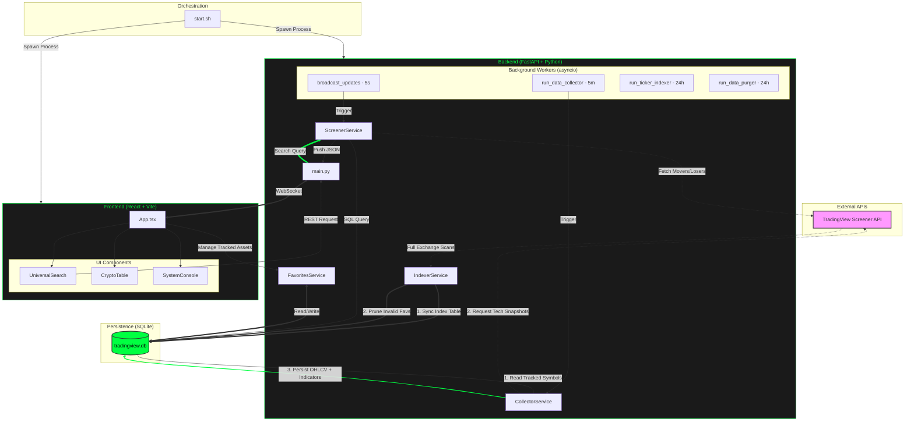

# Project Architecture & Technical Deep-Dive

This document provides an accurate technical overview of the Market Trading Screener architecture, mapping the exact code logic found in the backend services and frontend components.

## System Architecture Diagram

---

## Detailed Logic Verification (100% Code-Aligned)

### 1. Service Layer Roles
- **IndexerService**: Performs paginated scans of the "Big Four" exchanges. Crucially, it manages the database integrity by **pruning** favorite assets that are no longer available on the supported exchanges.
- **ScreenerService**: 
    - **Live Scans**: Statelessly fetches the top 50 gainers or losers directly from the API.
    - **Ticker Search**: Executes a `LIKE` SQL query against the local `ticker_index` table.
- **CollectorService**: STATEFUL worker. It bridges the `favorites` table and the `market_data_history` table by taking interval-rounded snapshots.
- **FavoritesService**: Simple CRUD interface for the `favorites` table.

### 2. Synchronization Mechanisms
- **WebSocket (Movers)**: Hardcoded 5-second backend loop that broadcasts the result of `ScreenerService.get_top_movers(sort='desc')`.
- **REST Polling (Losers)**: Frontend-triggered 5-second loop that explicitly requests `get_top_movers(sort='asc')`.
- **Hybrid Merge**: `App.tsx` merges these two streams, prioritizing WebSocket for price updates but keeping the Losers sort stable during polling.

### 3. Data Flow Audit
- **TV $\rightarrow$ Backend**: Exclusively **REST (HTTP POST)** snapshots.
- **Backend $\rightarrow$ UI**: 
    - **Real-time**: WebSocket (WS).
    - **Management/Search**: REST (JSON).
- **Backend $\leftrightarrow$ DB**: **SQLModel (SQLite)**. Service-to-DB links are now explicitly mapped in the diagram (e.g., ScreenerSvc reading the index for searches).

---

## Technology Stack Justification (Updated)

| Category | Technology | Purpose | Newcomer Analogy |
| :--- | :--- | :--- | :--- |
| **Backend** | **FastAPI (Python)** | The "Brain" of the operation. Handles calculations and coordinates data. | Like a high-speed dispatch center. |
| **Frontend** | **React (TypeScript)** | The "Face" of the operation. Handles everything the user sees and clicks. | Like a dynamic, self-updating Lego set. |
| **Database** | **SQLite (SQLModel)** | The "Memory." Stores your favorites and history in a local file. | Like a very organized, digital filing cabinet. |
| **Build Tool** | **Vite** | The "Workshop." Bundles the frontend code and runs the dev server. | Like a super-fast assembly line. |
| **Styles** | **Tailwind CSS** | The "Paint." Controls the colors, spacing, and layout. | Like a set of standardized stickers you can slap onto any component. |