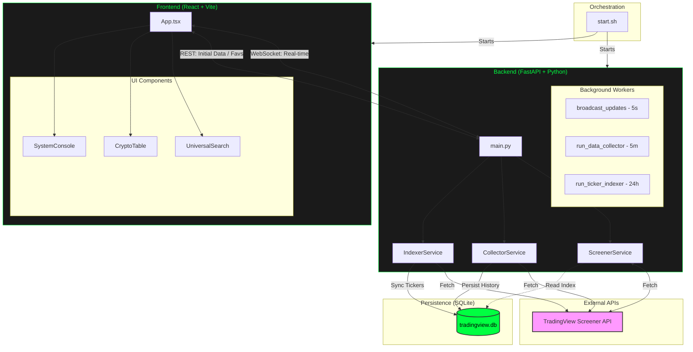

# Project Architecture

This document provides a high-level overview of the Market Trading Screener architecture, logic flow, and technology stack.

## System Architecture Diagram

## Data Flow Logic

### 1. Real-time Market Data
- **Mechanism**: The backend runs a `broadcast_updates` worker every 5 seconds.
- **Path**: `TradingView API` -> `ScreenerService` -> `FastAPI WebSocket` -> `React App State` -> `CryptoTable UI`.
- **Optimization**: Data is pushed via WebSockets to connected clients only when active, minimizing unnecessary API calls.

### 2. Historical Data Collection
- **Mechanism**: The `CollectorService` runs every 5 minutes.
- **Path**: `TradingView API` -> `CollectorService` -> `SQLModel` -> `tradingview.db`.
- **Retention**: Data is persisted for up to 6 months for "Favorite" assets across 11 timeframes.

### 3. Ticker Indexing
- **Mechanism**: The `IndexerService` runs once every 24 hours.
- **Path**: `TradingView API` -> `IndexerService` -> `SQLite (ticker_index)`.
- **Purpose**: Enables the `UniversalSearch` to instantly find all ~5,800+ tickers from the "Big Four" exchanges (Binance, Bybit, Bitget, OKX).

---

## Full-Stack Development Lifecycle

For a newcomer, understanding how a single "feature" (like adding a new data column) moves through the codebase is essential. Here is the typical lifecycle of a change in this project:

### Step 1: The Data Definition (Database Layer)
Everything starts with the "Shape" of the data. We define this in `backend/app/models.py`.
- **Action**: You add a new field to the `MarketDataHistory` or `TickerIndex` class.
- **Result**: When the app starts, `SQLModel` automatically updates the SQLite database structure to accommodate this new field.

### Step 2: The Data Retrieval (Service Layer)
Next, we need to fetch that data from the outside world. This happens in `backend/app/services/`.
- **Action**: In `screener.py`, you map a new field from the TradingView API to our internal Python logic.
- **Logic**: You decide how often this data should be fetched (e.g., every 5 seconds for live movers, or 5 minutes for historical persistence).

### Step 3: The Data Delivery (API Layer)
Now that the backend has the data, it needs to "serve" it to the frontend. This is done in `backend/app/main.py`.
- **Action**: You update the API endpoints (URLs) so that when the frontend asks for data, the new field is included in the JSON response.
- **WebSocket**: If it's a live update, you ensure the `broadcast_updates` function sends the new data through the "pipe" to all connected users.

### Step 4: The Data Handling (Frontend State)
The frontend receives the data and needs to store it in its memory. This is managed in `frontend/src/App.tsx`.
- **Action**: You update the TypeScript `interfaces` (the "rules" for our data) to include the new field. 
- **Effect**: React's `useState` and `useEffect` hooks detect the new data and trigger a "re-render" of the screen.

### Step 5: The Visual Display (UI Layer)
Finally, the user sees the change. This is usually in `frontend/src/components/CryptoTable.tsx`.
- **Action**: You add a new `<th>` (header) and `<td>` (data cell) to the table.
- **Result**: The data appears on your dashboard, color-coded and formatted for the user.

---

## Technology Stack Deep-Dive (Newcomer Edition)

| Category | Technology | Purpose | Newcomer Analogy |
| :--- | :--- | :--- | :--- |
| **Backend** | **FastAPI (Python)** | The "Brain" of the operation. Handles calculations and coordinates data. | Like a high-speed dispatch center. |
| **Frontend** | **React (TypeScript)** | The "Face" of the operation. Handles everything the user sees and clicks. | Like a dynamic, self-updating Lego set. |
| **Database** | **SQLite (SQLModel)** | The "Memory." Stores your favorites and history in a local file. | Like a very organized, digital filing cabinet. |
| **Build Tool** | **Vite** | The "Workshop." Bundles the frontend code and runs the dev server. | Like a super-fast assembly line. |
| **Styles** | **Tailwind CSS** | The "Paint." Controls the colors, spacing, and layout. | Like a set of standardized stickers you can slap onto any component. |
