# Project Architecture & Logic Deep-Dive

This document provides the definitive technical specification of the Market Trading Screener. It maps the implementation details of the Python/FastAPI backend and React frontend into a coherent system model.

## 1. System Architecture Diagram

```mermaid
flowchart TD
    %% EXTERNAL DATA SOURCE
    subgraph External["[EXTERNAL] TradingView Infrastructure"]
        TV_API[Screener API - REST Snapshots]
    end

    %% BACKEND CORE
    subgraph Backend["[BACKEND] FastAPI Engine"]
        direction TB
        Main[main.py - API & WS Gateway]
        
        subgraph Services["Service Layer"]
            S_Screen[ScreenerService]
            S_Coll[CollectorService]
            S_Idx[IndexerService]
            S_Fav[FavoritesService]
            S_Hist[FavHistoryService]
        end

        subgraph Workers["Async Background Workers"]
            W_Broad[broadcast_updates - 5s]
            W_Coll[run_data_collector - 5m]
            W_Idx[run_ticker_indexer - 24h]
            W_Purge[run_data_purger - 24h]
        end
    end

    %% PERSISTENCE
    subgraph Storage["[STORAGE] Local Persistence"]
        DB[(tradingview.db - SQLite)]
    end

    %% FRONTEND CORE
    subgraph Frontend["[FRONTEND] React Dashboard"]
        direction TB
        %% Search is placed at the top of Frontend to prevent line crossing to Backend
        Search[UniversalSearch.tsx]
        MainApp[App.tsx - State Manager]
        
        subgraph UI["Data Display Components"]
            Table[CryptoTable.tsx]
            Console[SystemConsole.tsx]
        end
    end

    %% --- DATA FLOW 1: DISCOVERY (Indexing) ---
    TV_API -.->|1. Fetch Catalog| S_Idx
    S_Idx ==>|2. Sync Tickers| DB
    S_Idx ==>|3. Prune Tracked| DB

    %% --- DATA FLOW 2: LIVE MARKET (Streaming) ---
    W_Broad -->|Trigger| S_Screen
    S_Screen -.->|4. Fetch Snapshots| TV_API
    S_Screen -->|5. Format JSON| Main
    Main <==>|6. WebSocket/REST| MainApp

    %% --- DATA FLOW 3: HISTORY (Collection) ---
    W_Coll -->|Trigger| S_Coll
    DB ==>|7. Read Favorites| S_Coll
    S_Coll -.->|8. Snapshot Fetch| TV_API
    S_Coll ==>|9. Append History| DB

    %% --- DATA FLOW 4: INTERACTION ---
    Search -->|10. Search Query| Main
    Main -->|11. SQL LIKE| S_Screen
    S_Screen ==>|12. Ticker Lookup| DB
    
    MainApp -->|13. Toggle Track| S_Fav
    S_Fav ==>|14. CRUD Ops| DB

    MainApp -->|15. Fetch History| S_Hist
    S_Hist ==>|16. Read Data| DB

    %% --- UI CONNECTIONS ---
    MainApp --- Search
    MainApp --- Table
    MainApp --- Console

    %% --- STYLING ---
    style TV_API fill:#f9f,stroke:#333,stroke-width:2px
    style DB fill:#00ff41,stroke:#333,stroke-width:2px,color:#000
    style Backend fill:#1a1a1a,stroke:#00ff41,stroke-width:1px,color:#00ff41
    style Frontend fill:#1a1a1a,stroke:#00ff41,stroke-width:1px,color:#00ff41
    style External fill:#000,stroke:#f9f,stroke-dasharray: 5 5
```

---

## 2. Comprehensive Workflow Cycle

### Phase A: Bootstrapping (start.sh)
1.  **Environment Isolation**: Checks for/creates a Python `venv` and installs `backend/requirements.txt`.
2.  **Dependency Resolution**: Ensures `frontend/node_modules` are installed.
3.  **Process Management**: Launches the FastAPI server (Port 8000) and Vite Dev Server (Port 5173) in parallel.
4.  **Database Ignition**: `init_db()` triggers `SQLModel`, creating the local SQLite file if missing.

### Phase B: Background Synchronization
1.  **The Indexer (W3)**: Scans every available ticker on the Big Four (Binance, Bybit, Bitget, OKX). It builds a local index so the user doesn't have to wait for network latency during searches.
2.  **The Collector (W2)**: Every 5 minutes, it "stamps" the current price and indicators (RSI, MACD, SMA) for all tracked assets into the database.
3.  **The Purger (W4)**: Every 24 hours, it scans the database and deletes any record older than 181 days, keeping the local file size efficient.

### Phase C: Data Ingestion & Delivery
1.  **The Live Scan**: The `ScreenerService` performs server-side sorting at TradingView to find the "True" top performers from the entire ~5,800+ asset catalog.
2.  **The Hybrid Bridge**:
    *   **Gainers**: Pushed automatically via **WebSocket** every 5 seconds.
    *   **Losers**: Pulled via **REST API** every 5 seconds (triggered by tab selection).
    *   **Favorites**: Pulled via REST to allow the user to change timeframes (e.g., viewing 1H history while the main market is on 5M) independently.

---

## 3. Detailed Dataflow Architecture

### 1. Ingestion Protocol
The system uses **stateless REST snapshots** from the external API. This is by design to bypass the limitations of public WebSockets, allowing the system to monitor thousands of coins simultaneously without managing thousands of open connections.

### 2. Processing Logic
- **Precision Management**: The backend enforces 8 decimal places for price and 6 for technical indicators.
- **Liquidity Floor**: A global filter `VOLUME_24H_IN_USD > 50,000` is applied to all market-wide scans to ensure reliability.
- **Interval Mapping**: The system maps frontend requests (e.g., "15M") to specific API change fields (`change|15`) to ensure the percentage values match the specific timeframe candles.

### 3. User State Loop
When a user "Tracks" an asset:
1.  **UI Event**: `MainApp` sends a POST request to `/api/v1/favorites`.
2.  **DB Entry**: `FavoritesService` adds the symbol to the `favorites` table.
3.  **Automated Tracking**: The next time `CollectorService` (W2) runs, it automatically includes this new symbol in its 5-minute data-persistence loop.

---

## 4. Technical Stack Breakdown

- **FastAPI**: Used as the asynchronous orchestrator. It manages the lifecycle of the four background workers using `asyncio.create_task`.
- **SQLModel**: Serves as the single source of truth for data shapes. The models in `app/models.py` define both the database schema and the API response structures.
- **React 19 + Vite**: Chosen for high-performance rendering. The `CryptoTable` uses memoized filtering logic to handle the 5-second data bursts without UI stuttering.
- **Tailwind CSS**: Implements the high-precision "Retro-Terminal" UI, including custom animations like `animate-breathing` for system status.
